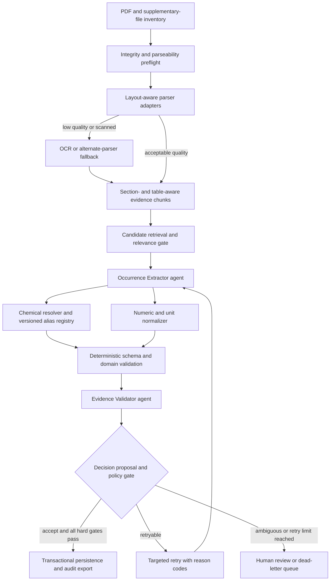
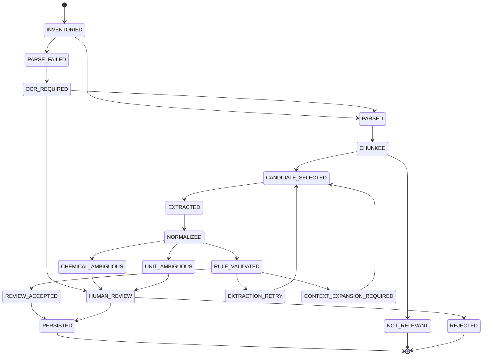

# Full-Text Evidence Extraction Harness

Status: design baseline for a pilot implementation. This document does not claim that the 2,176-document library has been parsed or extracted.

## Purpose and source library

The harness converts scientific full text into auditable environmental occurrence observations. The initial local source library is:

- Library root: `sources/library`
- PDF directory: `...\pdf`
- Download manifest: `...\manifest\downloaded_pdf_manifest.csv` and `.jsonl`
- Library summary: `...\manifest\library_summary.json`
- Not-downloaded DOI list: `...\manifest\not_downloaded_dois.txt`
- Manifest and summary reported on 2026-08-09: 2,176 PDF assets, 5.384 GB, 412 missing documents, and no inventory errors.
- A direct directory scan finds 2,175 ordinary `.pdf` files. The remaining manifest item, DOI `10.47874/2022:pp21-26`, was written on Windows as a zero-byte base file named `10.47874_2022` with a 578,891-byte NTFS alternate data stream named `pp21-26.pdf` because the DOI-derived filename contained a colon. The stream begins with `%PDF-1.6`, but many parsers will not discover it. Inventory preflight must materialize it under a sanitized ordinary filename and record the repair lineage before extraction.

The target product is not a flat list of chemical names and concentrations. It is a set of evidence-backed **occurrence observations** in which an analyte, result, environmental matrix, location, sampling time, and analytical method remain correctly related.

## Scope

The production main observation table targets reported field measurements of emerging contaminants in **actual natural surface water** (river, lake, stream, reservoir, estuary, coastal/marine water). The wider literature corpus may retain other matrices as reference/exclusion evidence, but they do not enter the main table. The harness must distinguish eligible water-column observations from:

- method-validation spikes, standards, blanks, recoveries, and calibration levels;
- toxicology exposure doses and effect concentrations;
- modeled, predicted, or risk-threshold values;
- literature-review summaries copied from other studies;
- negative statements and qualitative `ND`/`NQ` values from the numeric concentration stream; numeric `<number`/`≤number` observations are retained separately as left-censored records with the threshold preserved;
- aggregate class labels such as `PFAS`, `PAHs`, or `ΣPCB`, which are not always resolvable to one chemical structure;
- WWTP influent/effluent, secondary effluent, reclaimed water, groundwater, air, sediment, road dust, biota/tissue, laboratory/prepared water, stormwater, and other non-surface-water matrices;
- metals or other analytes measured on recovered microplastic/nanoplastic/plastic particles rather than in the actual water column.

If one paper reports both particle-bound concentrations and separate river/lake water concentrations, only the independently evidenced water-sample results are eligible for the main table. Generic `water` is accepted only when the evidence binds it to a named natural surface-water body.

Supplementary information is in scope as a separately inventoried and linked source because many tables containing site-level concentrations occur only in supporting files.

## Design principles

1. **Deterministic code owns state.** An orchestrator owns transitions, retries, idempotency, validation, persistence, and rollback. Neither language-model agent writes directly to authoritative tables.
2. **Evidence before normalization.** Raw names, values, units, table cells, and quotations are retained before any canonicalization or conversion.
3. **Observation-level relation binding.** A record represents one analyte-result-matrix-site-time-statistic relationship, not one paragraph or one chemical mention.
4. **Layout-aware parsing.** Tables, captions, footnotes, section boundaries, page coordinates, and reading order are first-class inputs. Fixed-token slicing is only a fallback inside an already identified structural unit.
5. **Version everything.** PDF hash, parser, OCR engine, chunker, schema, prompt, model, chemical dictionary, unit registry, and validation rules are recorded in lineage.
6. **Bounded retry.** Every retry has a reason code, targeted scope, maximum count, and terminal human-review or dead-letter state.
7. **High-precision automatic acceptance.** Thresholds are calibrated on a human-labeled pilot set. Confidence scores alone never authorize persistence.
8. **Absence is explicit.** `not_reported`, `not_applicable`, `not_found`, `parse_failed`, and `ambiguous` are different states.
9. **SQLite remains authoritative.** JSONL, CSV, and Parquet exports are reproducible audit or analytics products, consistent with the existing ECMonitor harness.
10. **One document is one isolation boundary.** The extractor and validator start with fresh model requests and empty conversational history for every document. No free-form text, hidden state, summaries, or examples from the preceding document may enter the next document's context.
11. **Commit and release after every document.** A document is checkpointed and transactionally persisted before its parser objects, model context, OCR images, temporary tables, and other disposable resources are released. The next document never depends on uncommitted in-memory state.
12. **The chemical registry is shared state, not model memory.** Each document reads the latest committed registry snapshot. New aliases are written as versioned proposals and become visible to later documents only after deterministic validation and the configured review gate.
13. **Chemical identity is article-first.** Before external lookup, the harness scans the current document for analyte lists, abbreviation tables, table headers/footnotes, and first full-name definitions. PFAS and other short/product aliases remain `reported_name` plus provisional/unresolved status when the article does not establish a unique entity; PubChem/CompTox/OPSIN/RDKit may corroborate but must not override contradictory document-local evidence.

## Why the original two-agent idea needs a harness around it

The proposed extractor and validator are useful semantic roles, but two unconstrained agents create correlated errors and ambiguous ownership. The production design therefore combines them with deterministic services:

| Component | Owns | Must not own |
| --- | --- | --- |
| Orchestrator/state machine | Jobs, leases, transitions, retry budgets, checkpoints, transactions | Semantic extraction |
| PDF parser/OCR adapters | Layout, text, tables, coordinates, parser quality metrics | Scientific interpretation |
| Candidate selector | Section/table retrieval and relevance gates | Final occurrence decision |
| Occurrence Extractor agent | Evidence-bound candidate observations | Database writes, unit conversion policy, invented identifiers |
| Chemical resolver | Alias lookup, candidate search, identifier provenance, dictionary versions | Forcing class or mixture names into one compound |
| Numeric/unit normalizer | Parsing qualifiers and ranges; dimension-safe conversion | Guessing missing basis or censored values |
| Deterministic validators | JSON Schema, enums, relation constraints, evidence coverage, duplicate checks | Free-form repair of scientific meaning |
| Evidence Validator agent | Field-by-field entailment and accept/retry/escalate proposal | Direct persistence or silent record editing |
| Persistence layer | Transactional accepted records, audit mirrors, supersession | Accepting unvalidated candidates |
| Human review queue | Ambiguity resolution and gold-set labels | Untraceable edits |

The validator should use a different prompt and, where feasible, a different model family from the extractor. It reviews the cited source evidence and expanded neighboring context, not only the extractor JSON.

## Comparable systems and reusable lessons

| Work or standard | Relevant pattern | Adaptation for ECMonitor |
| --- | --- | --- |
| Librarian of Alexandria | Modular document conversion, relevance filtering, parallel structured extraction, and source tracing | Reuse modular boundaries but add environmental observation semantics and strict transactional persistence.[^loa] |
| ComProScanner | Extractor, validator, classifier, and aggregator roles for scientific composition-property records | Retain role separation; move final acceptance and state transitions into deterministic code.[^compro] |
| Food-hazard LLM extraction study | Chunk classification, fixed schemas, hazard-concentration extraction, and retention of raw plus standardized units | Extend from food hazards to environmental matrices, sites, sampling time, censoring, and method QA/QC.[^foodhazard] |
| ChemDataExtractor | Domain-aware chemical entity and property extraction | Use as an optional candidate generator or baseline, not as the sole source of truth.[^cde] |
| ContaminOSO | Ontology-based representation of contaminants, samples, study design, and results | Reuse relationship thinking and controlled vocabularies when defining observation entities.[^contaminoso] |
| GROBID, Docling, MinerU, and Nougat | Complementary scientific-PDF, layout, table, reading-order, and OCR capabilities | Define a parser adapter contract and benchmark multiple parsers on difficult PDFs instead of locking in one parser.[^grobid] [^docling] [^mineru] [^nougat] |
| EPA WQX and Water Quality Portal | Explicit Result, Method, Location, sample/media, and detection/quantitation-limit concepts | Align environmental result fields and controlled vocabularies where practical.[^wqx] |
| OGC SensorThings | Observation, ObservedProperty, FeatureOfInterest, and Datastream relationships | Use as a conceptual check that measured property, feature/site, time, and result remain linked.[^sensorthings] |
| PubChem, EPA CompTox/DSSTox, and ChEBI | Complementary chemical identifiers, structures, synonyms, and curated concepts | Resolve through multiple sources, preserve source-specific identifiers, and record conflicts rather than selecting silently.[^pubchem] [^comptox] [^chebi] |
| QUDT and UCUM | Machine-readable units, dimensions, and quantity kinds | Store raw units, normalized units, dimensions, basis, and conversion provenance.[^qudt] [^ucum] |

## End-to-end architecture

## State machine

The orchestrator stores transitions as immutable events and updates a current-state projection transactionally.

Recommended terminal distinctions are `NOT_RELEVANT`, `NO_FIELD_MEASUREMENTS_REPORTED`, `PARSE_FAILED`, `REJECTED`, `DEAD_LETTER`, and `PERSISTED`. These must not be collapsed into a single “no result” status.

## Stage 1: inventory and preflight

For every primary PDF and supplementary file, calculate or verify:

- stable `document_id`, DOI, source-manifest row, local path, bytes, page count, and SHA-256;
- MIME signature, encryption/password state, truncation, zero-text-page ratio, and duplicate hash;
- whether text is embedded, OCR is likely required, or character encoding is corrupt;
- DOI agreement among manifest, filename, PDF metadata, first page, and Crossref metadata;
- link from supplementary material to the primary article;
- parser attempt history and quality metrics.

A missing page count or hash in the current manifest should be filled by a derived inventory table rather than silently mutating the original download manifest.

## Stage 2: parser adapter contract

Do not select one parser solely from headline benchmark claims. Each adapter must emit a common intermediate representation:

- pages and page dimensions;
- ordered blocks with type, text, page, bounding box, and reading-order index;
- headings and section hierarchy;
- tables with cells, row/column spans, headers, captions, and footnotes;
- figures and captions;
- references, formulas, and optional token/character offsets;
- parser warnings and quantitative quality scores.

Start with a 30–50-document parser benchmark containing native text, scanned pages, double columns, rotated tables, multi-page tables, mixed fonts, and supplementary PDFs. Keep the best output per structural region if parser fusion is introduced; never merge text without provenance.

## Stage 3: evidence chunks

A chunk is an addressable evidence package, not just a token window. Required chunk types include:

- `section_text`;
- `table` with caption, repeated headers, cells, and footnotes;
- `figure_caption`;
- `method_block`;
- `location_block`;
- `supplementary_table`;
- `neighbor_context` assembled on demand.

Each chunk retains `chunk_id`, parser version, source document, pages, section path, table or figure ID, coordinates or character spans, and adjacent chunk IDs. Tables must remain intact where possible. For an oversized table, split by logical row groups while repeating all headers, units, captions, footnotes, and table identifiers.

Candidate retrieval should use section labels, deterministic keywords, table headers, entity/value patterns, and optional embeddings. It should prioritize Results, Monitoring/Occurrence, Sampling, Materials and Methods, tables, and supplementary tables, but it must not discard other sections before recall is measured.

## Stage 4: relevance and observation typing

Before expensive extraction, classify the document and each candidate chunk. Suggested document labels are:

- `field_monitoring_with_quantitative_results`;
- `field_monitoring_without_extractable_results`;
- `laboratory_or_method_validation_only`;
- `toxicology_or_effect_study`;
- `modeling_or_risk_threshold_only`;
- `review_or_meta_analysis`;
- `not_relevant`;
- `uncertain`.

Candidate observations must declare an `observation_type`. Only configured types may enter the automatic acceptance path. Version 1 should auto-accept only `field_measurement`; all other types are retained as rejected candidates or routed for review.

## Stage 5: Occurrence Extractor agent

The extractor receives one evidence package plus a compact document context object. It must:

1. identify every supported observation explicitly evidenced in the package;
2. bind analyte, result, matrix, site, sampling time, statistic, and method references;
3. preserve raw names, values, units, qualifiers, and evidence quotes/cells;
4. distinguish field values from spikes, standards, recoveries, exposures, modeled values, thresholds, and cited prior work;
5. use `null` plus a missing-state code instead of guessing;
6. return schema-valid candidate JSON only;
7. request neighboring method/location/table context when a relation cannot be established.

The extractor may propose chemical identifiers but they are untrusted hints until resolved by deterministic services.

Every document receives a new `document_session_id`. Extractor calls for its chunks may share only an orchestrator-built context package from that same document. At document finalization, the session is destroyed; the next document receives a new session, a fresh prompt, no prior chat history, and only versioned global services such as the validated chemical registry and unit vocabulary. Prompt caching must be limited to static instructions and schemas, never document content.

## Stage 6: chemical entity resolution

The chemical resolver is a service plus versioned registry, not a prompt-only synonym list.

### Resolution record

For each raw mention, retain:

- raw name and exact span;
- document-local abbreviation definition and scope;
- canonical display name;
- PubChem CID, InChIKey, canonical/isomeric SMILES;
- CAS Registry Number with source and status;
- EPA DTXSID/DSSTox identifier;
- ChEBI identifier when applicable;
- entity type: `single_substance`, `salt`, `isomer`, `mixture`, `class`, `sum_parameter`, `transformation_product`, `unknown`;
- candidate identifiers, match method, score, provenance, and conflict flags;
- resolver and dictionary version.

### Resolution order

1. exact match in the versioned local alias registry;
2. document-local abbreviation definitions and table-footnote mappings;
3. normalized name lookup against PubChem;
4. CompTox/DSSTox lookup or batch reconciliation for environmental chemicals;
5. ChEBI lookup for curated chemical entities;
6. structure/CAS cross-check where evidence exists;
7. unresolved or ambiguous status if candidates conflict.

A CAS number is not assumed to be unique, current, or appropriate for a class/mixture. No service may force `PFAS`, `ΣPAH`, a commercial formulation, an unspecified metabolite, or “total pesticides” into a single compound identifier. Alias-registry updates are append-only proposals followed by validation and version promotion.

### Real-time dictionary update without registry poisoning

"Real-time update" means that the next document may read aliases validated and committed by earlier documents; it does not mean that every model suggestion immediately becomes trusted global state. The registry uses four tiers:

1. `document_local`: an abbreviation or synonym valid only inside the current document;
2. `proposed`: a persisted cross-document alias proposal awaiting deterministic or human validation;
3. `validated`: an active alias available to subsequent documents;
4. `deprecated_or_conflicted`: retained for lineage but excluded from automatic resolution.

At document commit, the harness writes all observed names and alias proposals. Automatic promotion to `validated` is allowed only when an exact registry identifier or structure cross-check supports a one-to-one mapping, the validator confirms that the source mention denotes an individual chemical, and no identifier conflict exists. Novel, conflicting, class-like, or many-to-many aliases enter human review. Registry promotion is a separate atomic transaction with its own version; a failed document cannot partially update the active dictionary.

Human review may finish asynchronously after the document has already been committed and its working resources released. Pending aliases remain `proposed`, so subsequent documents continue with the latest safe `validated` snapshot instead of waiting or consuming an uncertain mapping. When a later human decision promotes or deprecates an alias, the registry records a new version and enqueues targeted re-resolution for earlier unresolved/proposed mentions that used the affected string. Prior observations are never mutated silently; accepted corrections create superseding record versions.

The final human-facing export must show both normalization and replacement history:

- `canonical_name`: the unified preferred name;
- `reported_name`: the exact name in the source document;
- `matched_alias`: the alias actually used to resolve the mention, when different;
- `alias_type`: abbreviation, synonym, translated name, spelling variant, trade name, formula, or other;
- `validated_aliases`: the current validated alternative-name list joined from the registry;
- registry version and identifier provenance.

This preserves the original wording while making all observations searchable under one canonical name.

## Stage 7: numeric and unit normalization

Every result stores both its literal representation and a parsed semantic representation.

Required concepts include:

- raw value text;
- value type: `single`, `range`, `mean`, `median`, `minimum`, `maximum`, `percentile`, `geometric_mean`, or `other_statistic`;
- numeric value or lower/upper bounds;
- qualifier: exact, `<`, `<=`, `>`, `>=`, ND, detected-not-quantified, estimated, or partially censored;
- raw and normalized units;
- quantity dimension and basis, such as water volume, dry mass, wet mass, lipid mass, particle count/volume, or organism mass;
- LOD, LOQ, MDL, MQL, reporting limit, and their units;
- sample count, detection frequency, SD, SE, CI, and percentile level;
- conversion factor, conversion rule, registry version, and whether required assumptions were available.

Conversions are permitted only when dimensions and basis are compatible. The harness must not convert dry-weight to wet-weight, dissolved to whole-water, or mass concentration to molar concentration without explicit supporting information. `<LOQ`, ND, and ranges are never collapsed to a single ordinary float.

## Stage 8: location, sample, time, and method

### Location

Store raw location text before geocoding. Separate country, first-level administration, water body, catchment, station/site, and coordinates. Record whether coordinates were reported, geocoded, centroid-derived, or inferred, together with spatial precision and source.

### Sample and matrix

At minimum capture environmental medium, matrix, phase/fraction, filtration state, sample type, depth, and whether the result is dissolved, particulate, whole-water, sediment dry weight, biota tissue, or another basis. Controlled values should align with a project vocabulary that can later map to WQX or another exchange model.

### Sampling time

Preserve raw text and represent start/end dates, year, season, campaign, frequency, and temporal precision. Publication date is never a substitute for sampling date.

### Analytical method

Capture only reported facts, including:

- sample collection and preservation;
- extraction/cleanup and sample preparation;
- instrument platform and detector;
- chromatography and mass-spectrometry mode;
- target, suspect, or non-target workflow;
- quantification/calibration method and internal standards;
- QA/QC, blanks, recoveries, matrix effects, replicate policy, and acceptance criteria;
- LOD/LOQ/MDL/MQL determination;
- cited standard method and method identifier.

Method facts may be document-level or observation-specific. Records reference a versioned method entity to avoid copying the same method block thousands of times.

## Stage 9: deterministic validation

Hard gates run before and after validator output:

- Draft 2020-12 JSON Schema validity;
- required identifiers and version fields;
- evidence anchors exist in the parsed source;
- quoted text or table cells match source content after controlled whitespace normalization;
- analyte-result-matrix-site/time bindings have evidence or an explicit unresolved state;
- units and numeric fields are internally consistent;
- field measurements are not method-validation or exposure values;
- accepted records have at least one primary concentration evidence anchor;
- chemical IDs do not conflict across sources without an ambiguity flag;
- duplicate and near-duplicate observation keys are checked;
- supersession rules protect previously accepted records.

Pure formatting failures should be repaired deterministically. Scientific ambiguity must not be “fixed” by string manipulation.

## Stage 10: Evidence Validator agent

The validator receives:

- the candidate JSON;
- the exact evidence anchors;
- the full table/caption/footnotes when applicable;
- neighboring context requested by policy;
- deterministic validation findings;
- the validator reason-code vocabulary.

It independently checks each high-risk relation: analyte, chemical specificity, value, unit, qualifier, matrix/basis, site, time, observation type, and method. For the analyte it must explicitly decide whether the mention denotes an individual chemical or a non-individual concept such as a family, class, sum/total parameter, mixture, commercial product, polymer category, or unspecified metabolite. It returns one proposal:

- `accept`: every required field is entailed and no hard validation error remains;
- `retry`: a bounded, repairable failure with failed field paths, reason codes, and requested context;
- `escalate`: ambiguity, conflicting evidence, parser failure, or policy-sensitive case;
- `reject`: evidence shows that the candidate is not a supported field observation.

The validator does not rewrite the record. Any proposed correction returns to the extractor/normalizer path and produces a new candidate version.

## Human-review boundary

Human review is reserved for scientific ambiguity, governance decisions, and calibrated quality control. It should not become a substitute for deterministic validation.

| Condition | Automatic action | Human review required? |
| --- | --- | --- |
| JSON type, whitespace, Unicode unit, or other lossless formatting problem | Deterministic repair and revalidation | No |
| Missing context that can be obtained from a bounded neighboring chunk | Targeted or expanded-context retry | No, unless retry limit is reached |
| Clearly reported umbrella term such as `PFAS`, `total pesticides`, or `?PCB`, with no component-level result | Route to an aggregate-analyte table or reject from the individual-chemical output | No, unless project scope may include aggregates |
| Name may denote either an individual chemical or a total/class concept, such as ambiguous `DDT`, `PCB`, metabolite, or abbreviation usage | Preserve candidates and evidence; block automatic acceptance | Yes |
| Multiple plausible PubChem/DTXSID/CAS mappings remain after lookup, or identifier sources conflict | Block dictionary promotion and observation acceptance | Yes |
| Novel alias would become cross-document global state but lacks an authoritative one-to-one identifier/structure cross-check | Keep in `proposed` tier | Yes |
| Trade name, commercial formulation, technical mixture, polymer category, or unknown composition is reported | Keep entity type explicit; do not invent a single-compound identity | Yes when component-level interpretation affects the output |
| Analyte-value-unit-matrix-site-time relation remains ambiguous after bounded retries | Preserve the full table/context package | Yes |
| OCR, merged cells, repeated headers, or reading order changes which chemical a value belongs to | Try alternate parser/OCR first | Yes if parsers disagree or remain unreliable |
| Unit or dry/wet/lipid/dissolved/whole-sample basis is missing and a conversion or comparison would change scientific meaning | Do not convert | Yes if the raw record cannot be safely represented without choosing an interpretation |
| Extractor and validator continue to disagree after the retry budget | Freeze candidate versions and evidence | Yes |
| Candidate conflicts with an existing accepted record, chemical alias, or supersession chain | Block overwrite | Yes |
| Supplementary material is referenced but absent and document completeness cannot be determined | Mark document incomplete and queue acquisition | Yes only when the missing material is likely to contain target results |
| Extremely unusual value is correctly quoted but suggests a possible unit/header/OCR error | Recheck source, parser, and unit deterministically | Yes if the anomaly remains and would materially affect downstream analysis |
| Random sample of otherwise auto-accepted records | Quality-control audit | Yes, at a configurable sampling rate |

The following are normally deterministic rejects rather than human-review cases: no field measurement, method-validation-only concentration, toxicology dose, modeled value, guideline threshold, unsupported/fabricated candidate, or an unambiguous general class excluded by policy. Optional method fields that are genuinely not reported may remain `null` and do not automatically require human review.

During the pilot, every accepted record requires human sign-off. After calibration, mandatory triggers remain human-reviewed while a configurable random sample of auto-accepted records is audited continuously. Human decisions create immutable events, may promote or deprecate dictionary aliases, and never silently edit an accepted record; corrections create a superseding version.

## Retry policy

Retry classes are deliberately different:

| Retry class | Example | Action |
| --- | --- | --- |
| `deterministic_repair` | JSON type or normalized whitespace | Repair without another model call, then revalidate |
| `targeted_field_retry` | Unit attached to wrong value | Re-extract only named fields from the same evidence |
| `expanded_context_retry` | Site or basis defined in adjacent chunk | Add bounded neighboring evidence |
| `alternate_parser_retry` | Broken table reading order | Reparse affected pages/table with another adapter |
| `ocr_retry` | Scanned or unreadable page | OCR affected pages and regenerate chunks |
| `chemical_resolution_retry` | Multiple identifier candidates | Query additional registries or human review |
| `human_review` | Irreducible ambiguity or retry limit | Queue full evidence package |

Default maximum semantic retries should be small (for example, three total attempts per candidate), configurable, and calibrated in the pilot. A retry carries machine-readable reason codes and failed JSON pointers. Repeated whole-document re-extraction is prohibited unless a document-level completeness audit explicitly requests it.

## Per-document commit, isolation, and resource lifecycle

The processing unit is one primary article plus its linked supplementary assets. The orchestrator follows this barrier sequence:

The commit barrier does not require every human-review task to be finished. It requires that pending human cases contain a durable, self-contained review package so the original parser/model context can be released safely. A later human decision operates on persisted evidence and creates new immutable events.

The commit barrier requires:

1. candidate, accepted/rejected, pending-human-review, review, retry, evidence, parser-quality, and document-completeness rows are written transactionally;
2. JSONL/CSV/Parquet outbox events are persisted before acknowledging completion;
3. chemical observations and alias proposals are persisted even when not promoted;
4. validated alias promotion completes atomically and produces a new registry version;
5. the document checkpoint is marked `DOCUMENT_COMMITTED` only after integrity checks pass;
6. parser handles, model/session objects, page images, GPU tensors, temporary tables, and caches containing document content are released;
7. temporary files are deleted only after durable artifacts are checksummed and committed;
8. the original PDF and required reproducibility artifacts are never deleted by cleanup;
9. a failed cleanup is retryable and cannot roll back an already committed document;
10. the next document cannot be leased until the previous document crosses the commit barrier, unless parallel workers use strictly separate processes and document-scoped work directories.

For bounded disk usage, retain the original source asset, hashes, evidence anchors, parser/run metadata, accepted and rejected candidate lineage, and any parsed region required to reproduce evidence. Large intermediate page images and model-specific tensors are disposable. Full parsed documents may be stored as compressed per-document artifacts according to retention policy rather than kept in memory or one growing process object.

A worker should preferably process documents in a short-lived subprocess. Process exit is the strongest guarantee that model history, Python objects, GPU allocations, and parser caches from document N cannot affect document N+1. If a long-lived worker is used, the harness must enforce equivalent teardown checks and emit resource telemetry before leasing the next document.

## Persistence, identity, and audit

Recommended authoritative entities are:

- `extraction_documents` and `document_assets`;
- `parser_runs`, `parsed_blocks`, `parsed_tables`, and `evidence_chunks`;
- `extraction_jobs` and `state_transition_events`;
- `observation_candidates` and immutable candidate versions;
- `chemical_entities`, `chemical_aliases`, and resolution events;
- `analytical_methods`, `locations`, `samples`, and sampling events;
- accepted `occurrence_observations`;
- `observation_evidence` anchors;
- validation decisions (persisted in the compatibility table `review_decisions`), retry events, and human-review actions;
- `extraction_outbox` for idempotent exports.

An observation identity should be derived from document, analyte entity or unresolved mention, matrix/fraction, site, sampling period, statistic, and source cell/span. Collisions create a duplicate-review event rather than silent overwrite. Corrections create a new version with `supersedes_record_id`; deletes become retractions with reasons.

JSONL preserves nested audit records, CSV supports review, and Parquet supports analytics. All are rebuildable from SQLite and include export manifests and schema versions.

## Document-level completeness audit

Record-level validation is not enough. Before a document is marked complete, compare:

- all candidate concentration-bearing tables and supplementary tables against extracted evidence coverage;
- analyte lists in Methods against analytes represented in Results;
- location/site lists against accepted observations;
- parser table counts and failed regions;
- accepted, rejected, unresolved, and no-result candidate counts;
- references to supplementary files that are absent.

A document can be `record_complete` while still `document_incomplete`; these statuses must be separate.

## Pilot and evaluation plan

Do not begin with all 2,176 PDFs. Select a stratified 30–50-document pilot covering:

- native-text and scanned PDFs;
- single- and double-column layouts;
- simple, merged-cell, rotated, and multi-page tables;
- concentration data in prose, primary tables, and supplementary tables;
- multiple analytes, matrices, sites, and time points;
- class/sum parameters and ambiguous abbreviations;
- relevant documents with no extractable field measurements;
- method-validation, toxicology, review, and modeling negatives.

Create a human gold set at observation and evidence-anchor level. Measure:

- document/chunk relevance precision and recall;
- analyte entity and chemical-resolution accuracy;
- exact or tolerance-aware numeric/qualifier/unit accuracy;
- analyte-value-unit-matrix-location-time relation accuracy;
- evidence-anchor correctness;
- record-level precision/recall and document-level omission rate;
- automatic-accept precision;
- parser/OCR failure rate;
- retry rate, human-review rate, throughput, latency, and estimated cost.

The automatic path should initially optimize precision. Promotion thresholds, retry limits, parser selection, and chunk sizes are chosen from the gold set rather than intuition.

## Phased implementation

### Phase 0: contracts and benchmark set

- Freeze the v1 observation schema and reason-code vocabulary.
- Build the 30–50-document parser/extraction gold set.
- Hash the current PDF inventory without modifying source manifests.
- Implement parser, chemical resolver, unit normalizer, and agent interfaces as replaceable adapters.

### Phase 1: deterministic substrate

- Add SQLite migrations for jobs, evidence, candidates, lineage, review, and outbox.
- Implement inventory, checkpoints, resume, immutable events, and export manifests.
- Implement schema, evidence, number/unit, and duplicate validators.

### Phase 2: parser and chunk benchmark

- Evaluate at least two parser paths plus OCR fallback.
- Select default/fallback routes by document and region quality.
- Freeze chunk IDs and provenance behavior.

### Phase 3: two-agent pilot

- Run extraction and independent evidence review on the gold set.
- Tune prompts, context expansion, reason codes, and acceptance policy.
- Require human sign-off for all accepted records during calibration.

### Phase 4: controlled scale-up

- Process batches with resumable checkpoints and cost/quality dashboards.
- Sample automatically accepted records continuously.
- Run document-level completeness audits and acquire missing supplementary files.

### Phase 5: production promotion

- Promote only after acceptance precision and omission-rate targets are met.
- Version-lock parser, prompts, models, schema, dictionary, and unit rules per run.
- Support supersession, retraction, reprocessing, and reproducible exports.

## Initial non-goals

The first iteration does not attempt to:

- infer unreported coordinates, wet/dry conversions, or chemical structures;
- extract toxicological effect endpoints as occurrence observations;
- resolve every class, mixture, polymer, microplastic, or sum parameter to PubChem;
- auto-accept records lacking primary evidence anchors;
- treat model confidence as calibrated probability;
- bulk-process the entire library before pilot evaluation.

## Implemented runtime controls (P0–P2)

The production harness adds deterministic controls around the two model agents. These were
implemented to make the pipeline faster and more accurate without letting configuration
constraints block the models:

### P0 · Deterministic hallucination gate
`evidence.py` normalizes PDF glyph corruption (Unicode sub/superscripts, `µ` read as `l`,
Unicode dashes) and then checks that every extracted candidate's numeric value core actually
appears in its own source chunk (`evidence_anchor_reason`). A value that cannot be found
anywhere in its chunk is flagged `hallucination_suspect` and **skips the model validator
entirely**, going straight to human review. This spends zero model calls on the strongest
error mode (a fabricated concentration).

### P1a · Deterministic normalization layer
`normalize_document_text` repairs `lg/L → µg/L` (only in unit context), flattens Unicode
sub/superscripts (`ng·g⁻¹ → ng·g-1`), and preserves document structure. `normalize_parsed`
applies it to every parsed block before extraction.

### P1b · PubChem only for single compounds
`_resolve_candidate` checks `looks_non_individual` (class/family, sum/total, mixture, polymer,
unspecified metabolite) before any external resolution. Aggregate labels only hit the cheap
local registry, never PubChem, because they have no single compound identity.

### P1c · Adaptive concurrency governor
`batch.ConcurrencyGovernor` bounds in-flight documents and reacts to gateway transport strain:
a retryable transport/gateway error steps the in-flight limit down; a streak of clean successes
steps it back up toward the ceiling. `--concurrency-floor` and `--concurrency-growth-streak`
tune it from the CLI.

### P2a · Precise retry
1. **Adapter-level transport quick-retry.** `json_command.py` retries the same self-contained
   request a bounded number of times (`--transport-retries`, short backoff) on retryable
   gateway failures (timeout, 5xx, rate limit, empty response) before a whole-document re-run
   is even considered. Error classification lives in `errors.py` and is shared with the batch
   runners.
2. **Validator retries are routed precisely.** `_process_chunk` splits validator `retry`
   decisions into *repairable-by-extraction* (missing/malformed name, value, evidence) and
   *not repairable* (registry/identity gaps such as `chemical_resolution_missing`). Only
   repairable retries trigger a re-prompt; non-repairable ones escalate to human review
   immediately, so a registry gap never burns full-chunk model calls looping until the retry
   budget is exhausted.
3. **Targeted repair feedback.** Repairable retries send the failing candidate payloads plus
   the full prior candidate list in `retry_feedback`, and the extractor prompt instructs the
   model to repair only the listed JSON pointers and re-emit every other candidate unchanged.
4. **Hallucination suspects are never re-prompted.** They go straight to human review.

### P2b · Focused concentration second pass
When a first extraction returns **zero candidates** but the chunk text contains concentration
patterns (value + mass/volume unit), the harness builds a small sub-chunk covering only those
hit regions (`concentration_hit_spans`) and spends **one** small model call on it
(`focused_concentration_second_pass`). This rescues documents whose data lives in flattened
tables or unusual units (for example the `lg/L` glyph case) that an over-conservative first
pass skipped. Disable with `--no-focused-second-pass`; cap size with `--max-focus-chars`.

### P2c · Human signoff feeds extractor few-shot
Human decisions are recorded through the `signoff` CLI command:
- `storage.FulltextControlPlane.get_human_review_task` / `resolve_human_review_task` persist
  the signed disposition on the review task (new `human_review_resolutions` table).
- `signoff.SignedExampleStore` keeps a bounded JSONL log of accepted/rejected candidates and
  returns a capped, mixed few-shot bundle.
- The harness injects `document_context.signed_examples` into the next document's extractor.
  The prompt treats them strictly as teaching exemplars of output shape and quality bar and
  forbids copying their values/chemicals/sites/dates.

The table below summarises which failures are retried, at which layer, and how.

| Failure | Layer | Behavior |
| --- | --- | --- |
| Gateway timeout / 5xx / rate limit | `json_command` adapter | Same-request quick retry (bounded, short backoff) |
| Empty or schema-invalid model response | `fulltext_model_agent` | Internal repair call + fallback model before failing |
| Validator `retry`, repairable reason | harness chunk loop | Targeted re-prompt with `failed_candidates`/`prior_candidates` |
| Validator `retry`, registry/identity reason | harness chunk loop | Immediate human escalation, no re-extraction |
| 0 candidates + concentration patterns | harness chunk loop | One focused concentration second pass |
| Hallucination suspect | deterministic gate | Skip validator; straight to human review |

## Open implementation decisions

The pilot must answer:

1. Which parser or parser-routing policy performs best on this library?
2. What structural chunk sizes preserve table and location/method relations?
3. Which contaminant families require family-specific schemas or resolvers?
4. Which matrices and unit bases enter v1 automatic conversion?
5. What minimum evidence is required for site and sampling-time acceptance?
6. Which validator/model combination minimizes correlated extractor errors?
7. What automatic-accept precision target and audit sampling rate are operationally acceptable?
8. How should missing supplementary material be retrieved and version-linked?

## Human review → signoff → rule adoption

Pilot-stage accepts and genuinely ambiguous observations are routed to human review. High-confidence
secondary-source and non-occurrence experiment records are rejected deterministically after signed
human feedback has established the rule. The closed loop for turning human judgment back into
automatic behavior is:

0. `scripts/build_review_list.py <run_root> [--output REVIEW_LIST.md]`
   - reads pending `human_review_tasks` from `state/control.sqlite3` and writes a Markdown
     review list grouped by review category, with an **LOD/LOQ column** so censored / no-value
     records surface the paper's detection/quantification limit for the human's decision whether
     to keep the record as `detection` evidence (left-censored handling, see
     `docs/research/review_standards_research/left_censored_data_handling.md`).
1. `scripts/review_and_adopt.py <run_root> --verdicts verdicts.jsonl`
   - reads human verdicts (`task_id`, `disposition` in `accepted|rejected`, optional `note`
     and `reason_codes`);
   - resolves each task in `state/control.sqlite3` (`human_review_resolutions`) and appends the
     signed decision to `state/signed_review_examples.jsonl`;
   - aggregates per-reason-code counts (`SignedExampleStore.reason_code_stats`);
   - writes `review_adoption/review_adoption_report.md` and
     `review_adoption/adopted_review_rules.json` proposing which reason codes are safe to
     promote to deterministic gates (thresholds: `--min-signoffs`, `--reject-share`,
     `--accept-share`, defaults 3 / 0.9 / 0.9).
2. The deterministic gates in `src/ecmonitor/fulltext_extraction/quality.py`
   (`evidence_quality_gate`) already implement the core non-field classes directly:
   - `literature_summary_value` / `secondary_cited_value` plus primary-source provenance failure →
     deterministic reject (`secondary_cited_study_not_primary_observation`,
     `missing_primary_observation_provenance`);
   - removal/adsorption/degradation treatment doses with synthetic/spiked or unconfirmed
     environmental provenance → deterministic reject;
   - ambiguous product/process labels without a unique chemical identifier → deterministic reject
     when combined with a hard provenance/experiment exclusion; otherwise route to the non-blocking
     `deferred_identity_evidence` queue until the current paper/SI supplies a unique identity;
   - canonicalization that drops an explicit isomer qualifier → bounded source recheck, then human
     review only if the source relation remains genuinely ambiguous;
   - `exceedance_ratio_not_concentration` (fold/times units or "exceeded limit by N times") →
     deterministic `rejected_non_observation`;
   - numeric `<number` / `≤number` → `accepted_censored` with the literal threshold preserved and no
     substitution by 0, LOD, or LOD/2;
   - qualitative `ND`/`NQ`, `detection_frequency_not_concentration`, and
     `no_measurable_concentration` → deterministic rejection from the numeric stream while retaining
     the qualitative audit evidence;
   - unresolved matrix/location/source binding or administrative hierarchy conflict → human review;
     identity evidence missing only because SI/analyte-list material is unavailable is deferred
     without blocking document commit.
3. Signed examples feed the next document's extractor as bounded few-shot exemplars
   (`SignedExampleStore.fewshot_examples`), and the validator prompt
   (`prompts/extraction/evidence_validator.md`, `evidence-validator-v1.8`) enforces the same
   standards as independent model-side checks.

These rules are grounded in `docs/research/review_standards_research/industry_standards_synthesis.md`
(NORMAN / EFSA / Helsel / EPA DSSTox / USGS monitoring practice).

[^loa]: Librarian of Alexandria article and implementation: https://pmc.ncbi.nlm.nih.gov/articles/PMC13292210/ and https://github.com/Alexandria-FAIR-OA/LOA
[^compro]: ComProScanner article and implementation: https://pubs.rsc.org/en/content/articlelanding/2026/dd/d5dd00521c and https://github.com/daltonomics/ComProScanner
[^foodhazard]: *Large Language Model Based Data Extraction and Integration for Chemical Food Safety Hazard Detection* preprint: https://arxiv.org/abs/2405.15787
[^cde]: ChemDataExtractor article and project documentation: https://pubs.rsc.org/en/content/articlelanding/2016/sc/c5sc04286a and https://chemdataextractor.org/
[^contaminoso]: ContaminOSO ontology article: https://pmc.ncbi.nlm.nih.gov/articles/PMC9212779/
[^grobid]: GROBID documentation and source: https://grobid.readthedocs.io/ and https://github.com/kermitt2/grobid
[^docling]: Docling technical report and source: https://arxiv.org/abs/2408.09869 and https://github.com/docling-project/docling
[^mineru]: MinerU paper and source: https://arxiv.org/abs/2409.18839 and https://github.com/opendatalab/MinerU
[^nougat]: Nougat paper: https://arxiv.org/abs/2308.13418
[^wqx]: EPA Water Quality Exchange documentation: https://www.epa.gov/waterdata/water-quality-exchange-web-services and https://cdx.epa.gov/WQXWeb/DomainValues/DomainValues.html
[^sensorthings]: OGC SensorThings standard overview: https://www.ogc.org/standards/sensorthings/
[^pubchem]: PubChem PUG REST documentation: https://pubchem.ncbi.nlm.nih.gov/docs/pug-rest
[^comptox]: EPA CompTox Chemicals Dashboard and API: https://comptox.epa.gov/dashboard/ and https://comptox.epa.gov/dashboard/api-docs/
[^chebi]: Chemical Entities of Biological Interest: https://www.ebi.ac.uk/chebi/
[^qudt]: QUDT overview: https://www.qudt.org/pages/QUDToverviewPage.html
[^ucum]: Unified Code for Units of Measure: https://ucum.org/ucum
